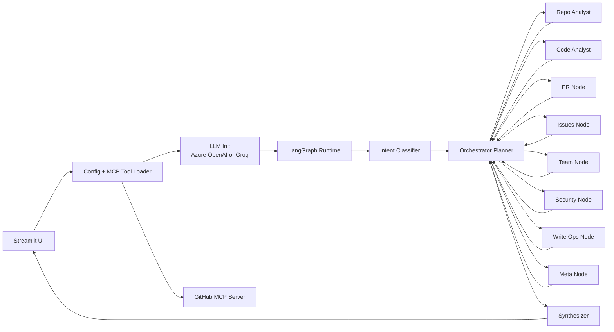

# GitHub Repository Intelligence Agent - Detailed Architecture

## Document Metadata

- Architecture Name: `PO-SIGA` (Planner-Orchestrated Specialist-Interactive Graph Architecture)
- Target Architecture Name: `PO-SIGA v2` (Provider-Agnostic, Policy-Driven, Test-Hardened)
- System Name: `GitHub Repository Intelligence Agent`
- Version: `1.0`
- Created By: `Basil Ahamed`
- License: `MIT` (see [LICENSE](LICENSE))

## 1) System Definition

This system is a Streamlit-hosted multi-agent GitHub assistant built on LangGraph. It accepts natural language repository questions, creates an execution plan, routes work to specialized nodes with GitHub MCP tools, and returns a synthesized answer with usage/cost telemetry.

The architecture combines:

- UI orchestration (`github_agent/ui.py`)
- Graph execution runtime (`github_agent/graph.py`)
- Planner + specialist node behaviors (`github_agent/agent_nodes.py`)
- Shared typed state (`github_agent/agent_state.py`)
- MCP tool connection layer (`github_agent/mcp_connection.py`)
- Runtime config resolution (`github_agent/runtime_context.py`)

## 2) Main Objective

Primary objective:

- Convert an ambiguous user repo question into a reliable, evidence-backed answer by enforcing plan-first execution and controlled tool use.

Operational objectives:

- Plan and execute iteratively instead of one-shot answering.
- Avoid path hallucination by forcing real repository tree discovery first.
- Route requests to domain-specific specialists.
- Keep the orchestration loop bounded and fail-safe.
- Support multiple LLM providers through a single initialization path.

## 3) Architecture Style

The system uses a hybrid architecture:

- Graph-based orchestration (LangGraph `StateGraph`)
- Central planner (orchestrator node)
- Specialist worker nodes with bounded tool sets
- Shared mutable state as the execution contract

This is a planner-worker architecture implemented as a directed cyclic graph with guardrails.

## 4) High-Level Component Model

## 5) Main LangGraph Workflow

Execution order:

1. `intent_classifier` parses query intent/domain and initializes planning fields.
2. `orchestrator` creates or updates a plan and selects `next_node`.
3. Selected specialist executes tools and stores result in `intermediate_results`.
4. Specialist returns to `orchestrator`.
5. Loop repeats until completion conditions are met.
6. `synthesizer` produces final user-facing markdown answer.

Routing rules:

- If `needs_clarification` is true, route directly to `synthesizer`.
- If `is_complete` is true, route to `synthesizer`.
- If `next_node` is invalid, fail-safe to `synthesizer`.

## 6) Agent Planning Model (How Planning Works)

Planning authority:

- The `orchestrator_node` is the only planner.
- Specialists do execution, not global planning.

Plan format:

- Plan is a list of step objects in state:
  - `step` (number)
  - `node` (target specialist)
  - `action` (instruction for specialist)
  - `status` (`pending` or `done`)
  - `purpose` (semantic key, such as `tree_scan`)

Planning cycle:

1. On first loop, orchestrator forces a repository tree scan step.
2. Orchestrator reads accumulated evidence and failed keys.
3. Orchestrator emits updated full plan + `current_step` + `next_node`.
4. Specialist executes the action for `current_step` only.
5. Output is written with a stable result key.
6. Control returns to orchestrator for next decision.

Key planning constraints implemented in prompts/logic:

- Use only file paths found in actual tree scan output.
- Do not retry paths that already failed.
- Carry forward full plan; do not drop previous steps.
- Ensure `current_step` exists in plan before routing to a specialist.

## 7) Safety and Completion Guardrails

Runtime guardrails:

- Maximum loop count (`>= 15`) forces termination to synthesizer.
- Stuck-step detector terminates when the same step repeats too long.
- JSON parsing failure in orchestrator response falls back safely to synthesizer.
- Invalid route target falls back to synthesizer.

Tool-safety posture:

- Specialists are bound only to relevant tool subsets.
- Tool execution exceptions are captured and stored as tool error messages.
- Final answer is generated from collected evidence, not direct hallucinated paths.

## 8) LLM Provider Architecture

Current provider abstraction:

- Unified initializer: `get_llm(...)` in `github_agent/agent_nodes.py`
- Uses LangChain `init_chat_model`.
- Supported providers:
  - `azure_openai`
  - `groq`

Config resolution:

- `resolve_llm_config(...)` in `github_agent/runtime_context.py` validates provider-specific requirements.
- `build_graph_from_llm_config(...)` injects resolved provider config into graph construction.

Result:

- The rest of the graph is provider-agnostic; only initialization changes by provider.

## 9) State Contract (Execution Data Model)

Core state fields:

- Input: `user_query`, `repo_owner`, `repo_name`
- Planning/control: `intent`, `domain`, `plan`, `current_step`, `next_node`, `loop_count`
- Execution: `messages`, `tool_calls_made`, `intermediate_results`
- Output: `final_answer`, `error`

Planning-specific ephemeral fields:

- `_prev_step`
- `_stuck_count`

These fields implement stuck-loop detection and are internal orchestration controls.

## 10) Specialist Node Responsibilities

- `repo_analyst_node`: repository metadata timeline queries.
- `code_analyst_node`: tree scan, file content retrieval, code search.
- `pr_node`: pull request analysis/operations.
- `issues_node`: issue workflow operations.
- `team_node`: members/team discovery.
- `security_node`: security and secrets investigation.
- `write_ops_node`: file/repo mutations.
- `meta_node`: generic discovery and metadata enrichment.
- `synthesizer_node`: final narrative answer.

## 11) Target Architecture Direction (`PO-SIGA v2`)

Planned evolution priorities:

- Add formal tool-result schemas per specialist.
- Add orchestrator policy layer for deterministic routing constraints.
- Add unit/integration tests around planning loop and guardrails.
- Add versioned prompts and config profiles.
- Add per-provider cost models in telemetry.

## 12) Quality Attributes

- Reliability: bounded loops + fail-safe routing.
- Explainability: explicit plan/current step in state.
- Extensibility: add specialists without changing graph control model.
- Provider portability: common `init_chat_model` interface.
- Observability: logging, usage metadata, optional LangSmith tracing.

## 13) Ownership and Attribution

- Architecture authored by: `Basil Ahamed`
- Implementation baseline: current `github_agent` codebase
- License model: MIT
