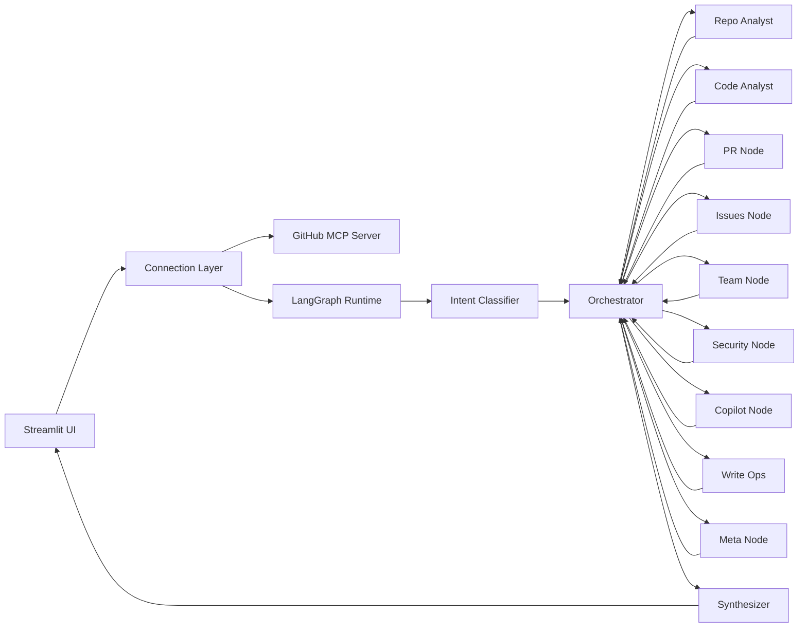

# GitHub Repository Intelligence Agent

Streamlit-based multi-agent assistant for GitHub repositories, built with LangGraph, Azure OpenAI/Groq, and GitHub MCP tools.

## Architecture + License

- Detailed architecture: [ARCHITECTURE.md](ARCHITECTURE.md)
- License: [LICENSE](LICENSE) (MIT)

## What This Project Does

This app lets you ask natural-language questions about a GitHub repository and routes the request through specialized agent nodes (code, PRs, issues, security, team, etc.) that call GitHub MCP tools, then synthesizes a final answer.

It supports:
- Repository/code analysis
- PR and issue workflows
- Team and metadata lookups
- Security scanning tasks
- Optional write operations (branch/file/repo actions)
- Usage and estimated token cost tracking
- Optional LangSmith tracing

## Architecture (High-Level)



### Runtime Flow

1. `ui.py` collects credentials/config and loads MCP tools.
2. `graph.py` builds a `StateGraph(AgentState)` and compiles it.
3. User query starts at `intent_classifier`.
4. `orchestrator` plans steps and chooses the next specialist node.
5. Specialist node binds only relevant tools and executes tool calls.
6. Results accumulate in `intermediate_results`.
7. Orchestrator loops until complete (or max loop/stuck guard).
8. `synthesizer` generates final markdown answer.
9. Usage/cost metrics and optional LangSmith trace are attached.

## Project Structure

```text
github_agent/
  ui.py                # Streamlit app and session orchestration
  graph.py             # LangGraph construction, routing, query execution
  agent_nodes.py       # Intent/orchestrator/specialist/synthesizer nodes
  agent_state.py       # Typed state contract for graph
  mcp_connection.py    # MCP client and tool-loading helpers
  runtime_context.py   # Azure + GitConnection resolution/parsing
  tracking.py          # Usage summary and cost estimation
  sample.ipynb         # Notebook prototype
backup_node.py         # Legacy/backup node implementation (not wired in graph.py)
```

## Prerequisites

- Python 3.10+ (project appears tested in Python 3.13 environment)
- Azure OpenAI deployment
- GitHub token/API key with access to your GitHub MCP endpoint
- Network access to:
  - Azure OpenAI endpoint
  - GitHub MCP server (default: `https://api.githubcopilot.com/mcp/`)
  - Optional LangSmith endpoints

## Installation

There is no `requirements.txt` in this repository, so install dependencies explicitly:

```powershell
python -m venv .venv
.venv\Scripts\Activate.ps1
pip install streamlit langgraph langchain-core langchain-openai langchain-mcp-adapters langsmith
```

## Run

From repository root:

```powershell
streamlit run github_agent/ui.py
```

## Configuration Guide (Sidebar)

### Azure OpenAI

- `Azure Endpoint`: e.g. `https://<resource>.openai.azure.com/`
- `Azure API Key`
- `Deployment Name`
- `Model Name`
- `API Version` (example in app: `2024-02-01`)

### GitHub MCP Server

- `MCP Server URL` (default: `https://api.githubcopilot.com/mcp/`)
- `MCP API Key / GitHub Token`
- Optional `GitConnection Row JSON` payload
  - If provided, repo metadata/token are resolved via `runtime_context.resolve_git_connection`.

### Repository

If you are not using `GitConnection Row JSON`, set:
- `Repo Owner`
- `Repo Name`

### Optional LangSmith

- Enable tracing checkbox
- Project/API/Web URL + API key

## Query Execution Details

### Core Node Responsibilities

- `intent_classifier_node`: classifies `intent`, `domain`, `needs_clarification`.
- `orchestrator_node`: creates/updates plan, routes next node, enforces loop and stuck-step guards.
- `code_analyst_node`: enforces tree scan first, then exact-path reads/search.
- `repo_analyst_node`: branches/commits/tags/releases.
- `pr_node`: PR read/write/review operations.
- `issues_node`: issue workflows.
- `team_node`: users/teams info.
- `security_node`: secret scan and targeted code reads.
- `copilot_node`: Copilot automation actions.
- `write_ops_node`: branch/repo/file mutation tools.
- `meta_node`: repo/user/label discovery.
- `synthesizer_node`: final markdown answer from collected evidence.

### State Model (`agent_state.py`)

The graph state tracks:
- Inputs: query + repo identity
- Control: intent/domain/plan/current step/loop count
- Execution: tool calls + intermediate results + messages
- Output: final answer + error

## Observability and Cost

- `tracking.py` summarizes token usage via `get_usage_metadata_callback`.
- Estimated USD cost is computed from model pricing table (currently includes `gpt-4o` baseline logic).
- UI shows per-run token/cost metrics.
- If LangSmith is enabled, the run URL is shown in chat/status panel.
- Live logs are streamed into Streamlit session state via a custom logging handler.

## Common Troubleshooting

- "Connection failed": verify MCP URL/token and endpoint reachability.
- "Missing Azure settings": all Azure fields are required before connect.
- Empty/invalid GitConnection JSON: must be valid JSON and include resolvable `repo_url`.
- No answer or weak answer: ensure repo owner/name are correct and tools loaded successfully.
- LangSmith errors: disable tracing or validate LangSmith key/API URL/Web URL.

## Security Notes

- Do not commit API keys/tokens.
- Use least-privilege GitHub tokens for MCP access.
- Treat write-operation tools as potentially destructive and restrict by policy.

## Suggested Next Improvements

1. Add a locked `requirements.txt` or `pyproject.toml`.
2. Convert local absolute imports to package-relative imports for cleaner module execution.
3. Add unit tests for routing/orchestrator behavior and config resolution.
4. Add structured tool-result schemas to improve synthesizer reliability.
